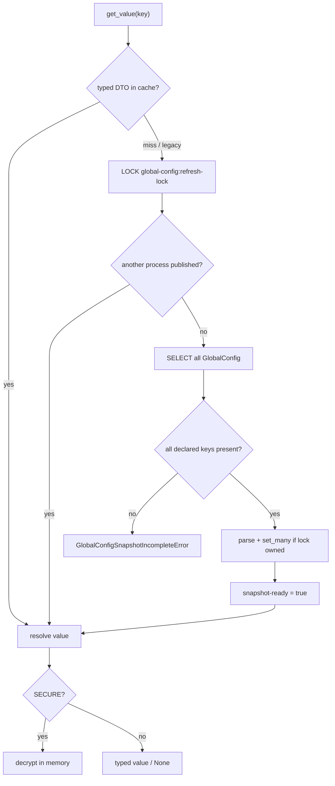

<Since v="1.0.1" />

Runtime code reads values only through `get_value()`. ORM reads of a single key, custom cache-aside keys, and domain fallbacks are out of scope for this package.

## Read contract

1. Read `global-config:{key}` from Django cache.
2. Accept only a `GlobalConfigCacheValueDTO`. Legacy untyped entries are a miss.
3. On miss, wait for `global-config:refresh-lock`.
4. After acquiring the lock, re-check the requested key.
5. If another process has not published, read every `GlobalConfig` row.
6. Fail if any declared definition key is missing.
7. Parse the full snapshot. One parse failure aborts publish.
8. Publish values and the readiness marker with `set_many` while the lock is still owned.
9. Resolve the requested key. `SECURE` is decrypted only in memory.

There is no single-row database fallback. Keys have no TTL. Freshness comes from a full refresh, not expiry.

## Refresh triggers

- synchronous cache miss
- `post_save` on `GlobalConfig` via `transaction.on_commit()`
- `post_migrate` after initialization
- optional Celery task `django_gc.refresh_global_configs_cache`

Initialization suppresses per-row refresh and schedules one commit-time refresh.

Rows live in explicit tables `global_config` and `global_config_category`.
