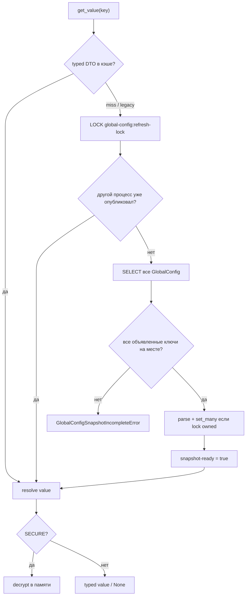

<Since v="1.0.1" />
<Changed v="1.0.2" />

Runtime-код читает значения только через `get_value()`. ORM-чтение одного ключа, свои cache-aside ключи и доменные fallback в пакет не входят.

## Контракт чтения

1. Прочитать `global-config:{key}` из Django cache.
2. Принять только `GlobalConfigCacheValueDTO`. Старые нетипизированные записи — miss.
3. При miss ждать `global-config:refresh-lock`.
4. После захвата lock повторно проверить запрошенный ключ.
5. Если другой процесс не опубликовал снимок, прочитать все строки `GlobalConfig`.
6. Остановиться, если отсутствует любой объявленный ключ.
7. Разобрать весь снимок. Ошибка одного значения отменяет публикацию.
8. Опубликовать значения и маркер готовности через `set_many`, пока lock принадлежит процессу.
9. Вернуть запрошенный ключ. `SECURE` расшифровывается только в памяти.

Fallback к чтению одной строки из БД нет. У ключей нет TTL. Актуальность даёт полный refresh, а не истечение.

## Когда обновляется снимок

- синхронный cache miss
- `post_save` у `GlobalConfig` через `transaction.on_commit()`
- `post_migrate` после инициализации
- необязательная Celery-задача `django_gc.refresh_global_configs_cache`

Инициализация подавляет per-row refresh и планирует один refresh после commit.

Строки хранятся в явных таблицах `global_configs` и `global_config_categories`.
